<div align="center">

# AeroBO

### Answer questions about an aeroplane. Watch it get designed. Then fly it.


</div>

<p align="center">
  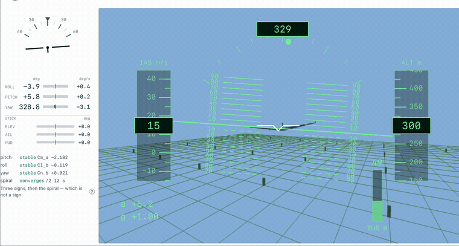
</p>

<div align="center">

*A wing that was optimised ninety seconds earlier, in a turn.*
Full clips: **[the turn](docs/media/flight-yaw.mp4)** · **[the phugoid](docs/media/flight-pitch.mp4)**

</div>

<div align="center">

**Conceptual aircraft design is a long argument with yourself.**
AeroBO makes it a sequence of questions instead — and then hands you the
aeroplane and lets you fly it to see whether the answers were any good.

</div>

---

## Get it

Three ways in. Every one of them ends the same way: a folder with a launcher
in it, and nothing to install first — **not even Python**.

**1 · Download a release** — the simplest.
[**Releases ▸ latest ▸ `AeroBO-<version>.zip`**](https://github.com/TomyCabrer/Wing-Design-Bayesian-Optimisation/releases/latest), unzip it, then double-click
**`AeroBO.command`** (macOS) · **`AeroBO.bat`** (Windows) · run `./AeroBO.sh` (Linux).

**2 · Clone it** — if you want updates to be a `git pull`.

```bash
git clone https://github.com/TomyCabrer/Wing-Design-Bayesian-Optimisation.git
cd AeroBO && ./AeroBO.command        # macOS · AeroBO.bat on Windows · ./AeroBO.sh on Linux
```

**3 · One line** — clones into `~/AeroBO` and starts it.

```bash
curl -fsSL https://raw.githubusercontent.com/TomyCabrer/Wing-Design-Bayesian-Optimisation/main/installer/install.sh | bash
```

```powershell
irm https://raw.githubusercontent.com/TomyCabrer/Wing-Design-Bayesian-Optimisation/main/installer/install.ps1 | iex
```

The first start takes a few minutes: the launcher fetches its own Python and
solver stack into the app folder. After that it opens in a second, and
deleting the folder is the entire uninstall. Full detail, and the two things
a machine can legitimately lack, in **[INSTALL.md](INSTALL.md)**.

<p align="center">
  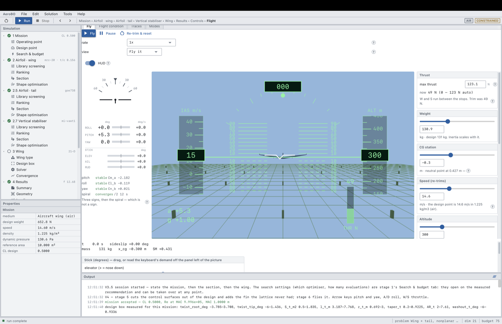
</p>

<div align="center">
<sub>One window. The pipeline down the left, the stage you are on in the middle, and everything it has been told at the bottom.</sub>
</div>

---

## The walk through the app

Every box is a question the shell asks. Every diamond is a decision, and the
loop it sends you round. Nothing here is a wizard you cannot leave: any answer
can be revisited, and the stages downstream re-derive from it.

<p align="center">
  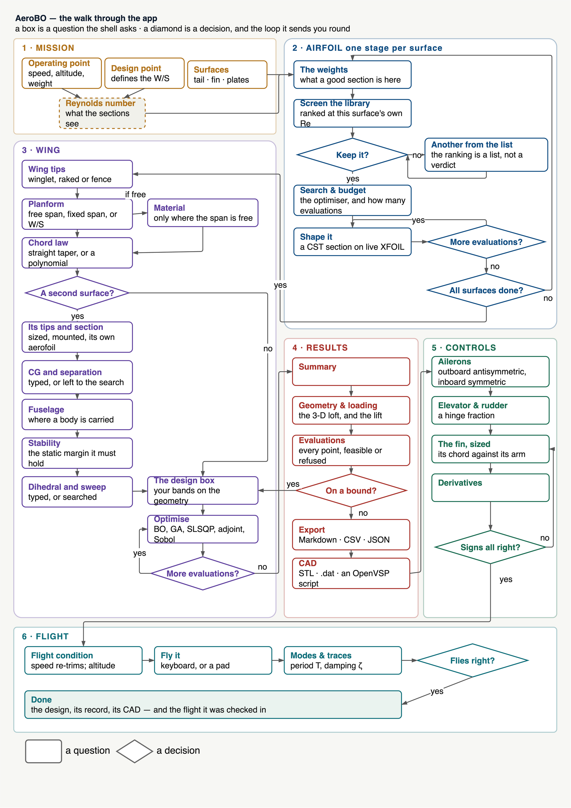
</p>

---


### What is it, and what is it for?

The **operating point** — speed, altitude, weight. The **design point**, which
is what actually fixes the wing loading. The **surfaces** the aeroplane is
going to have: tail, fin, endplates. From those alone the shell derives the
Reynolds number every section will see, so the aerofoil stage that follows is
screening at the flow the wing will really fly in, not at a round number.

The medium is a question here too — **air**, **water** or **track** — and a
hydrofoil or a car's rear wing walks the same six stages as an aeroplane.

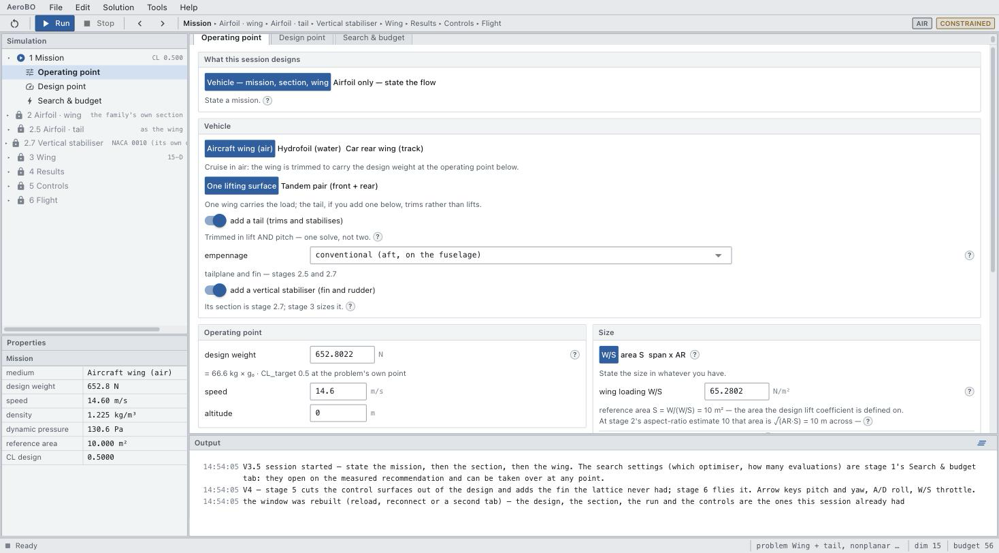

---


### One stage per surface, because a tail is not a small wing

You say what a good section is **here** — L/D at the design lift, maximum
L/D, stall margin, thickness, pitching moment — and the shell ranks a
2,000-aerofoil library at *this* surface's own Reynolds number. The ranking
is a list, not a verdict: take the winner, take the third one, or reject the
shelf entirely and **design** a section, a CST shape driven against live
XFOIL until the budget runs out.

Then it asks the same question again for the next surface.

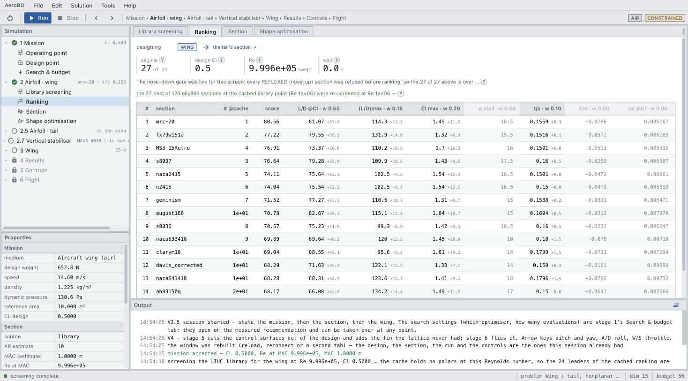

<div align="center">
<sub>Every column is a criterion you weighted; the small grey number beside each is what that section gains or loses against the field.</sub>
</div>

---


### The geometry, and which parts of it you are willing to argue about

Wing tips — winglet, raked, fence. Planform — free span, fixed span, or let
the wing loading decide. A chord law that is a polynomial rather than a
trapezoid. A second surface with its own tips and its own section. Where the
CG sits and how far the tail is from it. The static margin it has to hold.
Dihedral and sweep.

Every one of those is either **a number you type** or **a band you hand the
optimiser** — and that choice is the whole design method. What you fix, you
own; what you free, the search must earn.

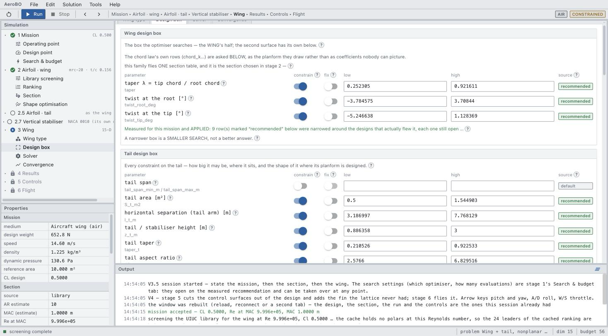

<div align="center">
<sub>The bands are not defaults. They were <b>measured</b> for this mission — narrowed around the designs that actually flew it, each row still open.</sub>
</div>

---


### Not a number — a record you can argue with

The summary, the constraint margins, the drag build-up, the 3-D loft and its
spanwise loading. It tells you when the answer is sitting on a bound, which
is the difference between "this is the optimum" and "this is the edge of the
box you drew".

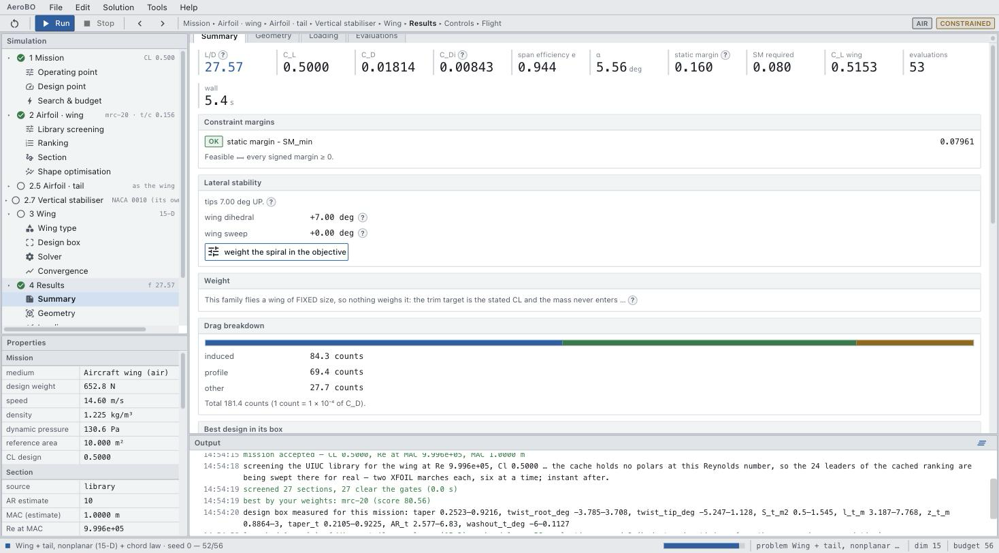

<p align="center">
  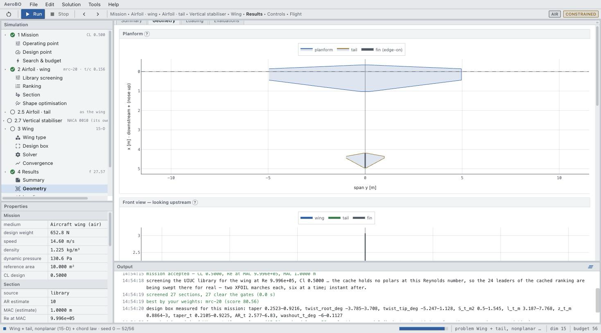
</p>

Leaves as Markdown, CSV and JSON — or as CAD: watertight STL, section `.dat`
files, and a script that rebuilds the whole thing natively in OpenVSP:

<table align="center">
<tr>
<td width="33%">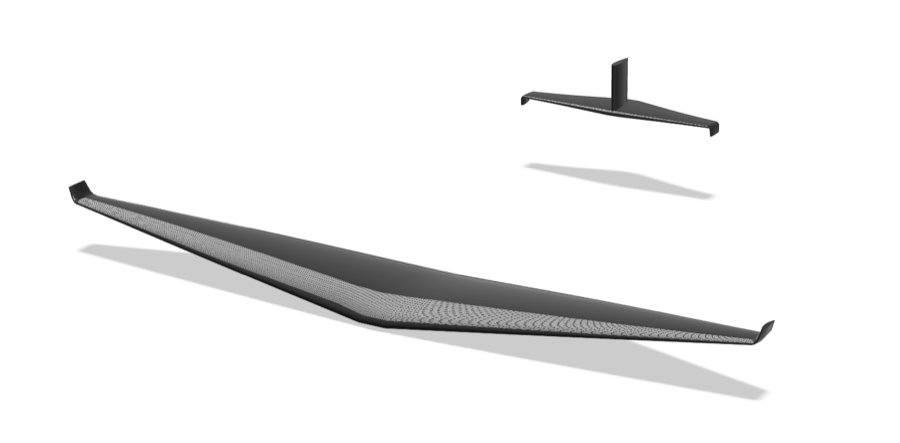</td>
<td width="33%">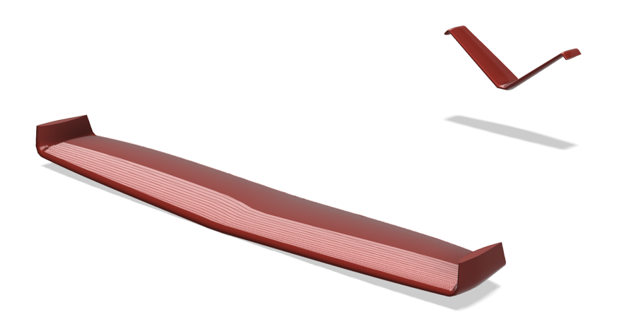</td>
<td width="33%">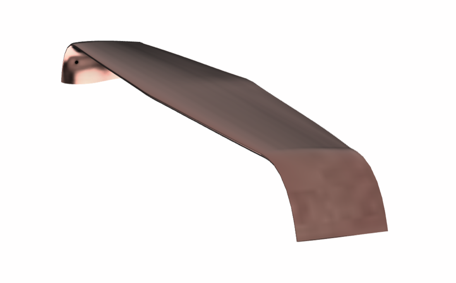</td>
</tr>
<tr>
<td align="center"><sub> conventional wing</sub></td>
<td align="center"><sub> wingtips + V-tail</sub></td>
<td align="center"><sub>a blended car wing</sub></td>
</tr>
<tr>
<td>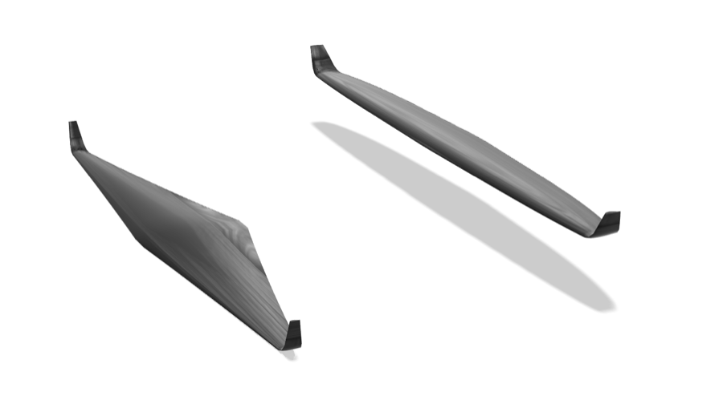</td>
<td>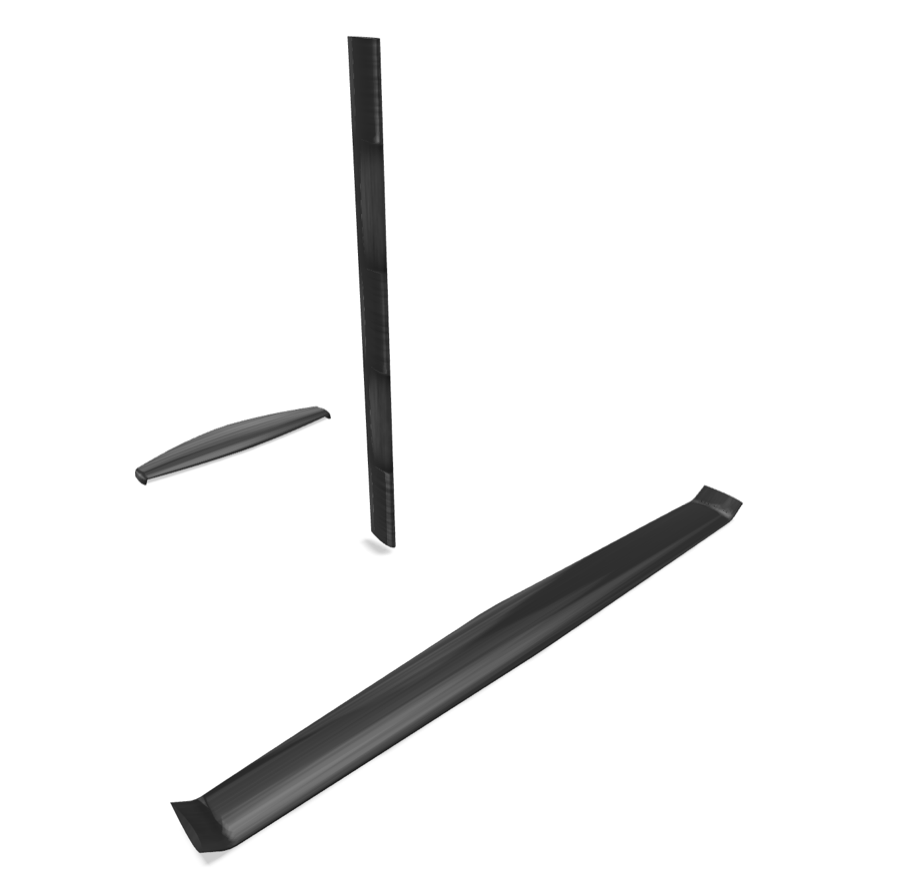</td>
<td>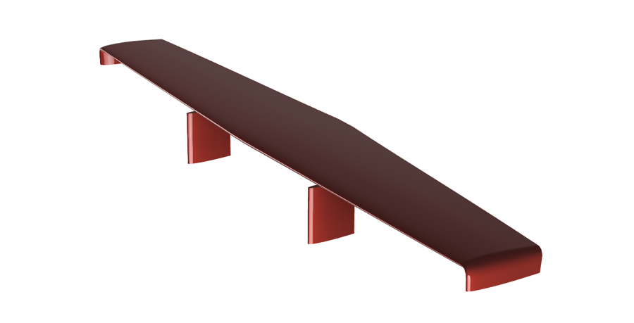</td>
</tr>
<tr>
<td align="center"><sub>a tandem pair</sub></td>
<td align="center"><sub>a hydrofoil — foil, strut, tail</sub></td>
<td align="center"><sub>a car rear wing</sub></td>
</tr>
</table>

<div align="center">
<sub>Same pipeline throughout. The medium is a question on stage 1, and everything downstream re-derives from it.</sub>
</div>

---


### Give it something to fly with

Ailerons — outboard antisymmetric, inboard symmetric. Elevator and rudder as
a hinge fraction. A fin **sized against its own arm** rather than guessed. Out
of that comes the full derivative set, and a check on every sign, because a
stability derivative with the wrong sign is an aeroplane that flies beautifully
in the wrong direction.

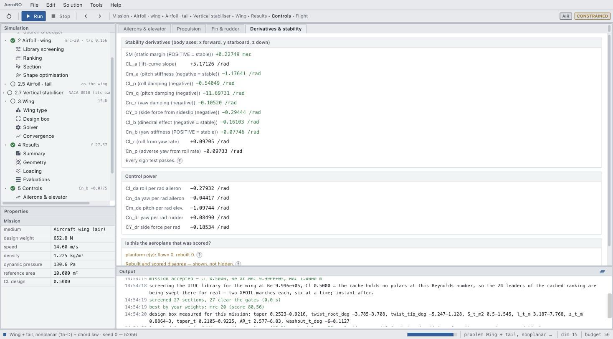

---


### Now fly it

Six degrees of freedom, live, from the keyboard or a DualSense controller.
Change the speed and it re-trims. The modes are named from their own
eigenvectors and their traces are drawn beside you: phugoid, short period,
Dutch roll, spiral — period, damping, and whether the thing you just designed
is actually pleasant to fly.

<p align="center">
  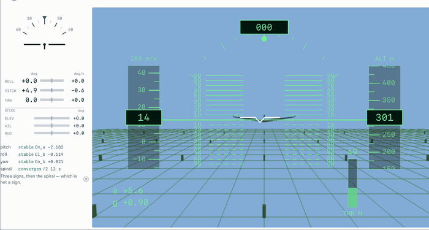
</p>

<div align="center">
<sub>Nobody is touching the stick. That is the phugoid, trading 15 m/s and 300 m against each other at the period the linearised system predicts.</sub>
</div>

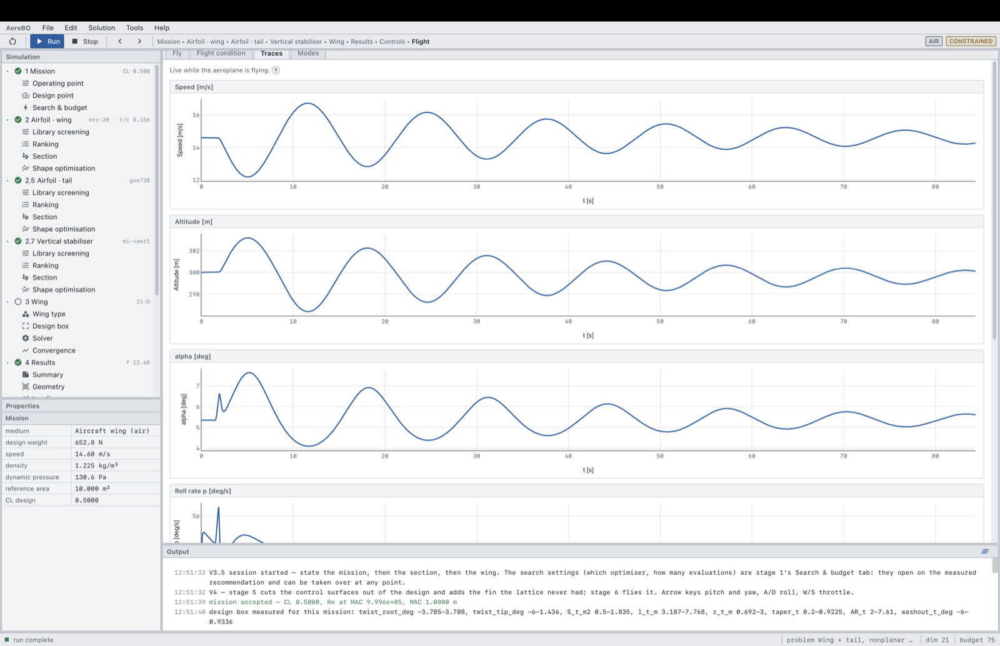

That is the point of the whole pipeline. A design is not finished when the
optimiser stops. It is finished when you have flown it.

---

## What is underneath

|  |  |
|---|---|
| **Aerodynamics** | Fourier-series lifting line; nonplanar Weissinger VLM with Trefftz-plane induced drag and an optional image plane for ground and free surface; Raymer wetted-area parasite build-up; Hoerner junction interference |
| **Sections** | Real XFOIL, driven and cached; CST (Kulfan) shapes; a NACA 4/24-series polar family; a ~2,000-aerofoil coordinate library screened under weighted criteria |
| **Search** | Bayesian optimisation (BoTorch — LogEI, LogCEI, UCB, qMES), a GA (pymoo), SLSQP, a penalty method, an exact-gradient adjoint through a differentiable twin, Sobol/DOE and full-factorial grids |
| **Flight** | Six-degree-of-freedom rigid-body integration, derivatives from the same lattice that sized the wing, modal decomposition of the linearised system |
| **Out** | Markdown · CSV · JSON · watertight STL · aerofoil `.dat` · an OpenVSP build script |

Everything is pure Python and NumPy. The physics kernel is a port of a mature
MATLAB reference implementation, validated against an elliptic-loading oracle;
MATLAB is never in the loop.

## Why it exists

An Imperial College London UROP under **Prof. Sylvain Laizet**, asking a
question that sounds simple and is not: *when you have a fixed number of
expensive evaluations, is Bayesian optimisation actually the right way to
spend them?*

Answering it honestly meant building something that could pose the same design
problem to BO, a GA, a gradient method and brute force under a matched budget,
on physics real enough for the comparison to mean anything — and then noticing
that a good score is not a good aeroplane, which is how the flight simulator
ended up in an optimisation project.

This repository is the app. Download it, design something, fly it.

## The repository

| | |
|---|---|
| `AeroBO.command` · `AeroBO.bat` · `AeroBO.sh` | double-click to install and start, on each platform |
| [`INSTALL.md`](INSTALL.md) | what the launcher does, what it will tell you, and what you can add (XFOIL) |
| `launch.py` | the entry point the launchers call; `python launch.py --check` prints the startup report |
| `installer/` | the two dependency locks and the one-line installers |
| `src/aerobo/` | the physics, the optimisers, and the API the shell calls |
| `gui/v4/` | the shell — the four-stage pipeline in `gui/v3/` plus controls and flight |
| `data/airfoils/` | the UIUC coordinate library and the pre-computed polar tables |
| `tests/` | `pytest` from a fresh clone; the ones marked `slow` drive the real XFOIL |

## Working on it

```bash
python3 -m venv .venv
.venv/bin/pip install -e ".[dev,bo]"
.venv/bin/pytest -m "not slow"
.venv/bin/python launch.py --browser
```

---

<div align="center">
<sub>Imperial College London · UROP · supervisor Prof. Sylvain Laizet · MIT licence</sub>
</div>
